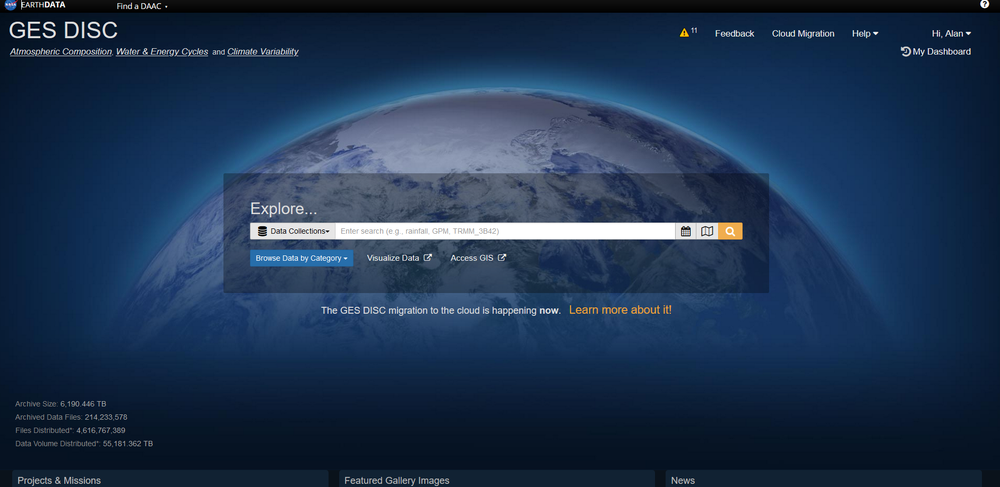
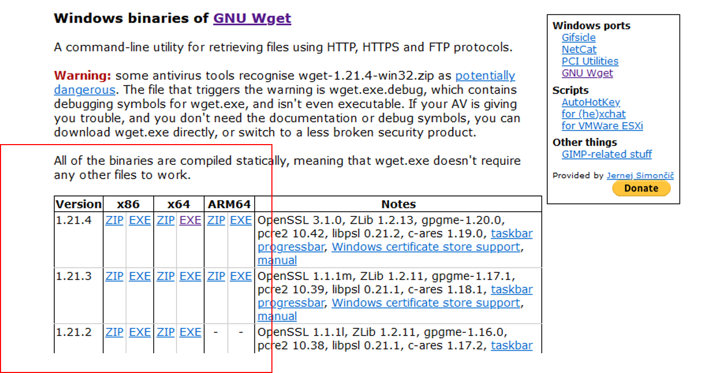

<!-- README.md is generated from README.Rmd. Please edit that file -->

```{r, include = FALSE}
knitr::opts_chunk$set(
  collapse = TRUE,
  comment = "#>"
)
```

# curso-gp-01-aquisicao

https://disc.gsfc.nasa.gov/



https://eternallybored.org/misc/wget/




