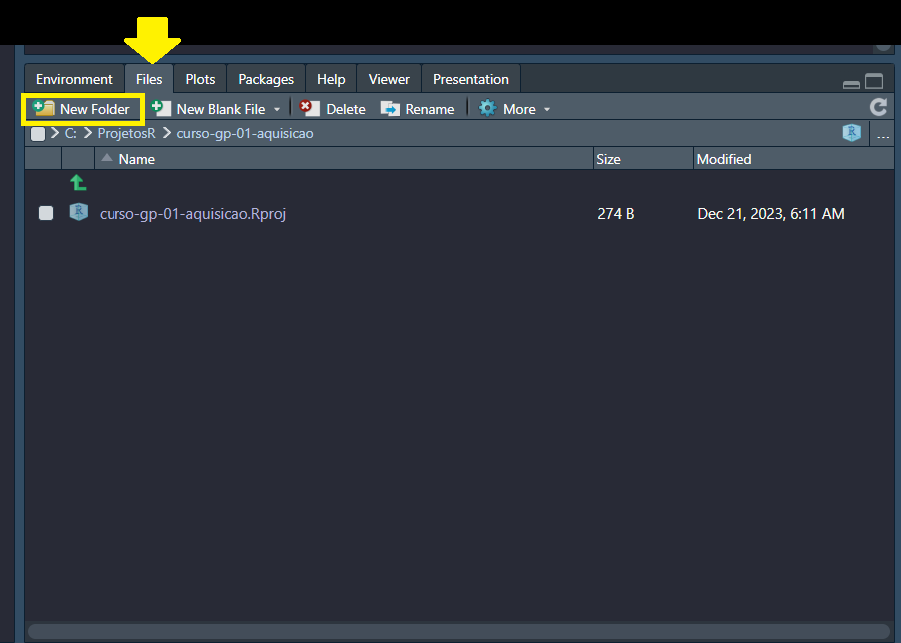
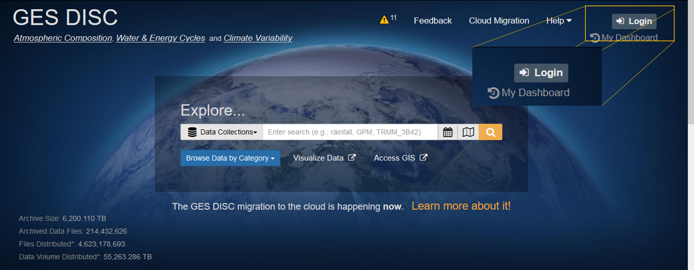

<!-- README.md is generated from README.Rmd. Please edit that file -->

```{r, include = FALSE}
knitr::opts_chunk$set(
  collapse = TRUE,
  warning = FALSE, 
  error = FALSE, 
  message = FALSE,
  comment = "#>"
)
```

# Cursos 01 - Aquisição de Dados do OCO-2[3] pelo GES DISC


Arte conceitual do  satélite Orbiting Carbon Observatory-2 (OCO-2)
Fonte: https://www.jpl.nasa.gov/images/pia18374-nasas-orbiting-carbon-observatory-oco-2-artist-concept

## Motivação

O GES DISC (Global Earth Science Data Information System) é um repositório de dados científicos de sensoriamento remoto da NASA. Ele contém dados de ampla variedade de sensores, incluindo satélites, aeronaves e estações terrestres. Os dados do GES DISC podem ser usados para uma variedade de aplicações, incluindo pesquisa científica, monitoramento ambiental e aplicações comerciais.

Este curso visa fornecer aos alunos do Grupo de Pesquisa em Ciência de Dados do Departamento de Ciências Exatas da FCAV-UNESP as habilidades necessárias para adquirir dados via GES DISC. O objetivo inicial é ensinar ao aluno como pesquisar dados, como baixar dados e como preparar os dados GES DISC para posterior uso em suas pesquisas.

Além, disso, devido ao fato desse curso ser introdutório, serão abordados temas como a criação de projetos no RStudio, a reprodutibilidade das análises e as formas de endereçamento dos arquivos.

## Criação do Projeto

A criação de projetos no RStudio é uma prática fundamental para qualquer pessoa que trabalhe com dados usando o R. Os projetos permitem que você estruture seus dados, código e relatórios de forma organizada e eficiente. Isso pode ajudar o aluno a economizar tempo e esforço, e também pode tornar seu trabalho mais reprodutível.

### Reprodutibilidade

A reprodutibilidade é a capacidade de repetir os resultados de um experimento ou análise. É uma prática importante na ciência e em outras áreas, pois garante que os resultados sejam confiáveis e passíveis de verificaçãp por outros pesquisadores.

NEsse contexto, a criação de projetos no RStudio ajuda a melhorar a reprodutibilidade do trabalho em desenvolvimento. Isso ocorre porque os projetos permitem que você armazene todos os dados e código necessários para executar uma análise em um único local. Isso torna mais fácil compartilhar nosso trabalho com outros pesquisadores e colaboradores, garantindo que esses possam reproduzir seus as análises e obter os resultados.

### Formas de Endereçamento (Relativo e Absoluto)

No contexto de programação, o endereçamento é a maneira de identificar um local na memória. Isso pode ser feito usando um **endereço absoluto** ou um **endereço relativo**.

Um **endereço absoluto* é um número que identifica um local específico na memória. Por exemplo, o endereço absoluto da variável `x` pode ser `0x12345678`.

Um **endereço relativo** é um número que identifica um local na memória em relação a um ponto de referência. Por exemplo, o endereço relativo do elemento `0` de um vetor `v` pode ser `0`.

No contexto do RStudio, o endereçamento é usado para identificar arquivos e pastas em um projeto. O endereçamento relativo é a maneira mais comum de fazer isso. Tal prática tornar o código mais conciso e fácil de manter e de ler, sendo uma das primeiras recomendações para o estudante que inicia sua jornada nessa área.

A criação de projetos no RStudio torna o endereçamento relativo mais fácil. Isso ocorre porque os projetos fornecem um contexto para os caminhos de arquivos e pastas. Por exemplo, no projeto denominado `MeuProjeto`, podemos criar uma pasta chamada `data` para armazenar os dados. Então, poderemos ler os dados da pasta `data` usando o endereçamento relativo:

```{r, eval=FALSE}
# Criar um objeto para armazenar os dados
dados <- readr::read_rds("data/dados.rds")

# Visualizar os dados
View(dados)
```

O código acima criará um objeto no R chamado `dados` que contém os dados da pasta `data`. O **caminho relativo** `"data/dados.rds"` refere-se ao arquivo `dados.rds` na pasta `data` dentro do projeto previamento estruturado (denominado `MeuProjeto`). Observe que raiz, início do caminho, sempre será a pasta do projeto.

O **caminho absoluto** para o arquivo `dados.rds` seria diferente, dependendo do local do projeto no seu computador. Por exemplo, se o projeto estiver localizado na pasta `C:\Meus Documentos\MeuProjeto`, o caminho absoluto para o arquivo `dados.rds` seria `"C:\Meus Documentos\MeuProjeto\data\dados.csv"`. Caminho esse mais difícil de ser indentificado, uma vez que cada usuário poderá criar a pasta do projeto em diferentes diretórios de seus respectivos computadores.

Assim, o uso de endereçamento relativo tem várias vantagens, incluindo:

  + Tornar o código mais conciso e fácil entendimento.
  + Tornar o código mais portátil, pois não dependerá do local do projeto no computador.
  + Tornar o código mais reprodutível, pois os caminhos relativos são consistentes entre diferentes computadores (tendo como origem a pasta do projeto criado).


### Criação do Projeto no RStudio

Previamente à criação do projeto, devemos criar uma pasta que armazenará todos os vários projetos desenvolvidos pelos estudantes ao longo de suas atividades acadêmicas. Por exemplo, vamos criar um diretório chamado `ProjetosR` no diretório `C:/`


Uma vez criada a pastas de projetos, para criação de um novo projeto:

  1. Abra o RStudio.
  2. Clique em File > New Project.
  





## Criação da conta
https://disc.gsfc.nasa.gov/



## configura do Wget
https://eternallybored.org/misc/wget/


## Escolha da Base (Nível-2)

## Download dos dados

### Coteúdo referente ao arquivo `script_download.R`.

```{r, eval=FALSE}
url_filename <- dir("url/",pattern = ".txt") # nome do arquivo txt

urls <- read.table(paste0("url/",url_filename)) # leu as urls dentro do arquivo


n_urls <- nrow(urls) # numero de linhas no arquivo urls

n_split <- length(stringr::str_split(urls[1,1],"/",simplify=TRUE))

n_split

filenames_nc <- stringr::str_split_fixed(urls[,1],"/",n=Inf)[,n_split] # armazenando o nome dos arquivos
filenames_nc

#### download

for(i in 1:n_urls){
  repeat{
    dw <- try(download.file(urls[i,1],
                            paste0("data-raw/",filenames_nc[i]),
                            method="wget",
                            extra= c("--user=alan.panosso --password FMB675fmb675@")
    ))
    if(!(inherits(dw,"try-error")))
      break
  }
}
```


## Extração dos dados

### Conteúdo referente ao script `script_extracao.R`

```{r, eval = FALSE}
files_names <- list.files("data-raw/",
                          pattern = "nc")


exm <- ncdf4::nc_open(
  paste0("data-raw/",files_names[1])
)
typeof(exm)

for(i in 1:length(files_names)){
  if(i==1){
    df <- ncdf4::nc_open(paste0("data-raw/",files_names[i]))
    if(df$ndims==0){

    }else{
      xco2 <- data.frame(
        "longitude"=ncdf4::ncvar_get(df,varid="longitude"),
        "latitude"=ncdf4::ncvar_get(df,varid="latitude"),
        "time"=ncdf4::ncvar_get(df,varid="time"),
        "xco2"=ncdf4::ncvar_get(df,varid="xco2"),
        "xco2_quality_flag"=ncdf4::ncvar_get(df,varid="xco2_quality_flag"),
        "xco2_incerteza"=ncdf4::ncvar_get(df,varid="xco2_uncertainty")
      ) |>
        dplyr::filter(xco2_quality_flag==0) # quality = 0 ==> obs sem nuvem
    }
    ncdf4::nc_close(df)
  }else{
    df_a <- ncdf4::nc_open(paste0("data-raw/",files_names[i]))
    if(df_a$ndims == 0){

    }else{
      xco2_a <- data.frame(
        "longitude"=ncdf4::ncvar_get(df_a,varid="longitude"),
        "latitude"=ncdf4::ncvar_get(df_a,varid="latitude"),
        "time" = ncdf4::ncvar_get(df_a,varid="time"),
        "xco2" = ncdf4::ncvar_get(df_a,varid="xco2"),
        "xco2_quality_flag"=ncdf4::ncvar_get(df_a,varid="xco2_quality_flag"),
        "xco2_incerteza"=ncdf4::ncvar_get(df_a,varid="xco2_uncertainty")
      ) |>
        dplyr::filter(xco2_quality_flag==0)
    }
    ncdf4::nc_close(df_a)
    xco2 <- rbind(xco2,xco2_a) # stack = empilhar as tabelas
  }
}

xco2 <- xco2 |>
  dplyr::mutate(
    date = as.Date.POSIXct(time)
  )
# install.packages("readr")
readr::write_rds(xco2, "data/arquivo_xco2.rds")
```


```{r, eval=TRUE}
xco2 <- readr::read_rds("data/arquivo_xco2.rds")
xco2 |>
  dplyr::sample_n(1000) |>
  ggplot2::ggplot(ggplot2::aes(x=date,y=xco2)) +
  ggplot2::geom_point() +
  ggplot2::geom_line()

xco2 |>
  dplyr::sample_n(1000) |>
  ggplot2::ggplot(ggplot2::aes(x=xco2, y=..density..)) +
  ggplot2::geom_histogram(bins = 9,
                          color="black",
                          fill="gray") +
  ggplot2::geom_density(fill="red",alpha=0.05) +
  ggplot2::theme_bw()

```


