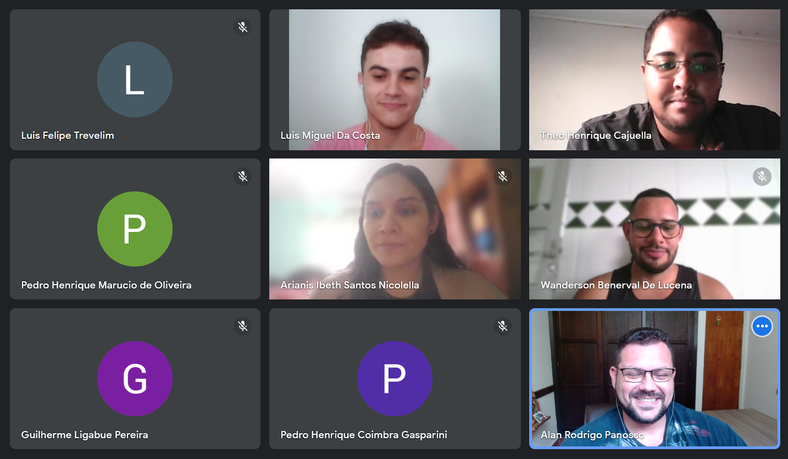

<!-- README.md is generated from README.Rmd. Please edit that file -->

```{r, include = FALSE}
knitr::opts_chunk$set(
  collapse = TRUE,
  warning = FALSE, 
  error = FALSE, 
  message = FALSE,
  comment = "#>"
)
```

# Cursos 01 - Aquisição de Dados do OCO-2[3] pelo GES DISC
## Ministrante: Eng. Agrônomo Luis Miguel da Costa
## Data: 20/12/2023


Arte conceitual do  satélite Orbiting Carbon Observatory-2 (OCO-2)
Fonte: https://www.jpl.nasa.gov/images/pia18374-nasas-orbiting-carbon-observatory-oco-2-artist-concept

## Motivação

O GES DISC (Global Earth Science Data Information System) é um repositório de dados científicos de sensoriamento remoto da NASA. Ele contém dados de ampla variedade de sensores, incluindo satélites, aeronaves e estações terrestres. Os dados do GES DISC podem ser usados para uma variedade de aplicações, incluindo pesquisa científica, monitoramento ambiental e aplicações comerciais.

Este curso visa fornecer aos alunos do Grupo de Pesquisa em Ciência de Dados do Departamento de Ciências Exatas da FCAV-UNESP as habilidades necessárias para adquirir dados via GES DISC. O objetivo inicial é ensinar ao aluno como pesquisar dados, como baixar dados e como preparar os dados GES DISC para posterior uso em suas pesquisas.

Além, disso, devido ao fato desse curso ser introdutório, serão abordados temas como a criação de projetos no RStudio, a reprodutibilidade das análises e as formas de endereçamento dos arquivos.

## Criação do Projeto

A criação de projetos no RStudio é uma prática fundamental para qualquer pessoa que trabalhe com dados usando o R. Os projetos permitem que você estruture seus dados, código e relatórios de forma organizada e eficiente. Isso pode ajudar o aluno a economizar tempo e esforço, e também pode tornar seu trabalho mais reprodutível.

### Reprodutibilidade

A reprodutibilidade é a capacidade de repetir os resultados de um experimento ou análise. É uma prática importante na ciência e em outras áreas, pois garante que os resultados sejam confiáveis e passíveis de verificaçãp por outros pesquisadores.

NEsse contexto, a criação de projetos no RStudio ajuda a melhorar a reprodutibilidade do trabalho em desenvolvimento. Isso ocorre porque os projetos permitem que você armazene todos os dados e código necessários para executar uma análise em um único local. Isso torna mais fácil compartilhar nosso trabalho com outros pesquisadores e colaboradores, garantindo que esses possam reproduzir seus as análises e obter os resultados.

### Formas de Endereçamento (Relativo e Absoluto)

No contexto de programação, o endereçamento é a maneira de identificar um local na memória. Isso pode ser feito usando um **endereço absoluto** ou um **endereço relativo**.

Um **endereço absoluto* é um número que identifica um local específico na memória. Por exemplo, o endereço absoluto da variável `x` pode ser `0x12345678`.

Um **endereço relativo** é um número que identifica um local na memória em relação a um ponto de referência. Por exemplo, o endereço relativo do elemento `0` de um vetor `v` pode ser `0`.

No contexto do RStudio, o endereçamento é usado para identificar arquivos e pastas em um projeto. O endereçamento relativo é a maneira mais comum de fazer isso. Tal prática tornar o código mais conciso e fácil de manter e de ler, sendo uma das primeiras recomendações para o estudante que inicia sua jornada nessa área.

A criação de projetos no RStudio torna o endereçamento relativo mais fácil. Isso ocorre porque os projetos fornecem um contexto para os caminhos de arquivos e pastas. Por exemplo, no projeto denominado `MeuProjeto`, podemos criar uma pasta chamada `data` para armazenar os dados. Então, poderemos ler os dados da pasta `data` usando o endereçamento relativo:

```{r, eval=FALSE}
# Criar um objeto para armazenar os dados
dados <- readr::read_rds("data/dados.rds")

# Visualizar os dados
View(dados)
```

O código acima criará um objeto no R chamado `dados` que contém os dados da pasta `data`. O **caminho relativo** `"data/dados.rds"` refere-se ao arquivo `dados.rds` na pasta `data` dentro do projeto previamento estruturado (denominado `MeuProjeto`). Observe que raiz, início do caminho, sempre será a pasta do projeto.

O **caminho absoluto** para o arquivo `dados.rds` seria diferente, dependendo do local do projeto no seu computador. Por exemplo, se o projeto estiver localizado na pasta `C:\Meus Documentos\MeuProjeto`, o caminho absoluto para o arquivo `dados.rds` seria `"C:\Meus Documentos\MeuProjeto\data\dados.csv"`. Caminho esse mais difícil de ser indentificado, uma vez que cada usuário poderá criar a pasta do projeto em diferentes diretórios de seus respectivos computadores.

Assim, o uso de endereçamento relativo tem várias vantagens, incluindo:

  + Tornar o código mais conciso e fácil entendimento.
  + Tornar o código mais portátil, pois não dependerá do local do projeto no computador.
  + Tornar o código mais reprodutível, pois os caminhos relativos são consistentes entre diferentes computadores (tendo como origem a pasta do projeto criado).


### Criação do Projeto no RStudio

Previamente à criação do projeto, devemos criar uma pasta que armazenará todos os vários projetos desenvolvidos pelos estudantes ao longo de suas atividades acadêmicas. Por exemplo, vamos criar um diretório chamado `ProjetosR` no diretório `C:/`


Uma vez criada a pastas de projetos, para criação de um novo projeto:

  1. Abra o RStudio.
  2. Clique em File > New Project.
  
E a janela abaixo será apresenta.
  

---

  3. Selecione > New Directory.
  4. Selecione > New Project.


---
Após esses passos, será apresentado a janela para definirmos o nome do nosso projeto e a pasta onde ele será armazenado, portanto:

  5. No campo *Directory name* digite o nome do projeto: `curso-gp-01-aquisicao`.

No campo *Create project as subdirectory of* selecione a pasta previamente criada para armazenamento de todos os projetos: 
  
  6. Selecione > Browse... > `C:/ProjetosR`


  7. Selecione > Create Project
  
Após isso outra janela do RStudo será apresentada ao usuário, mas agora, no canto direito superior, podemos identificar o projeto no qual a interface está vínculado. Isso garante a reprodutibilidade do nosso projeto, uma vez todo o gerenciamento de referencias será relativo à pasta do projeto `curso-gp-01-aquisicao`.


**OBSERVAÇÃO**  

  > <span style="color: red;">NUNCA, JAMAIS, EM HIPÓTESE ALGUMA, INICIEM SEUS TRABALHOS SEM GARANTIR QUE A INTERFACE DO RSTUDIO ESTEJA VINCULADA A UM PROJETO ESPECÍFICO</span>.


Caso seja necessário você poderá abrir o projeto manualmente:
  
  8. Selecione > File > Open Project...> Selecione a pasta que contem o subdiretório do projeto, e abra o arquivo com o nome do projeto, como apresentado abaixo: 


Agora precisamos criar subdiretórios para manipular os vários arquivos, scripts e relatórios, que serão utilizados e gerados durante o projeto: 
  9. Para isso identifique a aba `File` presente em um dos paineis do RStudio.
  10. Certifique-se que o diretório de trabalho é o `C: > ProjetosR > curso-gp-01-aquisicao`


  11. Clique > New Folder e crie as pastas: 
  
    * R  
    * data  
    * data-raw  
    * url  

como apresentado abaixo.


Ao longo do desenvolvimento do projeto, novas pastas poderão ser adicionas a ele com o objetivo de organizar, ainda mais, os documentos e relatórios, algumas pastas poderão ser:

    * img: para armazenamento de imagens;   
    * script: armazenamento dos scripts referentes as análises;  
    * Docs: para armazemanento de arquivos HTML, .docx ou .pdfs;
    * Output: saídas gráficas e relatórios.   

## Criação da conta no GES DISC

Para a criação da conta no site do GES DISC acesse o seguinte link: https://disc.gsfc.nasa.gov/ você deverá ser direcionado para a seguinte pagina. Ao ser direcionado para esta página, clique na aba login para ser redirecionado (como indicado em amarelo) 


Agora você foi redirecionado para a pagina de login, estando nesta pagina você deve clicar em `Register` para prosseguir. 


Agora você deve ter sido redirecionado para a pagina de cadastro (imagem abaixo), preencha todas as informações necessárias e pronto você está regristrado no servidor!


Depois de ter feito seu cadastro no servidor, agora precisamos liberar algumas licenças e autorizações para poder prosseguir com o `download`. Para isto faça seu `login` e após ter realizado ele, primeiramente (1) clique no seu nome e entre no seu `Earthdata Profile`. Em seguinda, já no seu perfil, clique em `Applications > Authorized Apps` (2). Por fim, primeiro clique em `APPROVE MORE APPLICATIONS` e busque as autorizações destacadas (3), **repita este passo para cada autorização**.


## Configuração do Wget

**Wget** é uma ferramenta criada pelo GNU Project. Você pode usá-la para recuperar conteúdos e arquivos de vários servidores na internet. O nome vem de uma combinação de World Wide Web e a palavra get. Ela suporta downloads via FTP, SFTP, HTML e HTTPS. Para realizar o download desta ferramenta entre no seguinte endereço: https://eternallybored.org/misc/wget/. 

Note que existem diversas versões para diferentes sistemas operacionais. Portanto, primeiro devemos identificar qual sistema operacional é o seu. 


Para isto, vá na barra de pesquisa do seu computador e digite `sistema` e clique na primeira opção que aparecer. Você deve ter sido redirecionado para uma pagina similar a esta abaixo, identifique seu sistema operacional como o exemplo abaixo. 


Agora que identificamos, volte para o endereço web e baixe o **primeiro** arquivo `.EXE` compativel com o seu windows. No meu caso seria a versão `1.21.4` em `64x`.

Feito o download vá até o diretorio onde o arquivo foi salvo e aperte as teclas `Ctrl + X` para recortar o arquivo desta pasta. Agora este passo é muito importante e perigoso, por isso, **cuidado**. Primeiro entre na pasta `C:`, em seguida na pasta `Windowns` e por fim na pasta `System32`, aperte `Ctrl + C` e copie o arquivo `wget.exe` para esta paste e depois feche esta pasta.

## Escolha da Base (Nível-2)

Os arquivos das missões OCO-2 e 3 são arquivos diários e globais do tipo `netCDF`, para podermos fazer a requisição dos dados, devemos voltar no site do [GES DISC](https://disc.gsfc.nasa.gov/) e buscar por OCO-2 (ou OCO-3).


Após buscar pela missão desejada (OCO-2 ou 3), você será direcionado para a seguinte pagina (imagem abaixo). Nesta pagina você deve clicar no arquivo `OCO-2(ou 3) Level 2 bias-corrected XCO2... (OCO-2_L2_Lite_FP.vr)`, geralmente é o primeiro arquivo, pois é o mais acessado e o mais recente. 


Em seguida você será redirecionado para a seguinte pagina e você deverá clicar em `get data`. 


Deverá aparece a seguinte janela após clicar em `get data`.


Nesta janela, primeiro vamos refinar a periodo de interesse como na imagem abaixo, lembrando que este é um exemplo e você pode alterar a serie temporal trabaçhada conforme o que você deseja pesquisar! (lembrando que a data está em formato americano `ano-mes-dia`).


Em seguida iremos refinar a região de interesse da mesma forma que fizemos para a série temporal. Para isto clique em `draw rectangle` como indicado na seta e depois desenhe o retangulo na área desejada.


Agora iremos clicar em `get data`.


Após clicar em `get data` outra janela irá aparecer, agora você deve esperar alguns instante até a lista de links aparecer. Quando a lista aparecer, leve o cursor do mouse até `Download Intructions` e depois clique em `Download the list of links` como indicado a seguir. **IMPORTANTE, FAÇA O DOWNLOAD DESTE ARQUIVO NA PASTA `url` QUE FOI CRIADA NESTE PROJETO**.


Por fim, confira na pasta `url/` se o arquivo `.txt` está salvo nela, como no exemplo abaixo:


Agora podemos prosseguir para o download!!!

## Download dos dados (links)

### Conteúdo referente ao arquivo `script_download.R`.

```{r, eval=FALSE}
url_filename <- dir("url/",pattern = ".txt") # nome do arquivo txt

urls <- read.table(paste0("url/",url_filename)) # leu as urls dentro do arquivo


n_urls <- nrow(urls) # numero de linhas no arquivo urls

n_split <- length(stringr::str_split(urls[1,1],"/",simplify=TRUE))

n_split

filenames_nc <- stringr::str_split_fixed(urls[,1],"/",n=Inf)[,n_split] # armazenando o nome dos arquivos
filenames_nc

#### download

for(i in 1:n_urls){
  repeat{
    dw <- try(download.file(urls[i,1],
                            paste0("data-raw/",filenames_nc[i]),
                            method="wget",
                            extra= c("--user=seu.usuario --password 5u4s3nh4")
    ))
    if(!(inherits(dw,"try-error")))
      break
  }
}
```

**Nesta etapa pode ocorrer algum erro por conta da má instalação do wget, pela falta de autorização na plataforma GES DISC, ou algum outro problema não listado aqui, caso o problema não seja o wget e autorização entre em contato com [Luis](lm.costa@unesp.br) ou [Alan](alan.panosso@unesp.br)** 

## Extração dos dados

### Conteúdo referente ao script `script_extracao.R`

```{r, eval = FALSE}
files_names <- list.files("data-raw/",
                          pattern = "nc")


exm <- ncdf4::nc_open(
  paste0("data-raw/",files_names[1])
)
typeof(exm)

for(i in 1:length(files_names)){
  if(i==1){
    df <- ncdf4::nc_open(paste0("data-raw/",files_names[i]))
    if(df$ndims==0){

    }else{
      xco2 <- data.frame(
        "longitude"=ncdf4::ncvar_get(df,varid="longitude"),
        "latitude"=ncdf4::ncvar_get(df,varid="latitude"),
        "time"=ncdf4::ncvar_get(df,varid="time"),
        "xco2"=ncdf4::ncvar_get(df,varid="xco2"),
        "xco2_quality_flag"=ncdf4::ncvar_get(df,varid="xco2_quality_flag"),
        "xco2_incerteza"=ncdf4::ncvar_get(df,varid="xco2_uncertainty")
      ) |>
        dplyr::filter(xco2_quality_flag==0) # quality = 0 ==> obs sem nuvem
    }
    ncdf4::nc_close(df)
  }else{
    df_a <- ncdf4::nc_open(paste0("data-raw/",files_names[i]))
    if(df_a$ndims == 0){

    }else{
      xco2_a <- data.frame(
        "longitude"=ncdf4::ncvar_get(df_a,varid="longitude"),
        "latitude"=ncdf4::ncvar_get(df_a,varid="latitude"),
        "time" = ncdf4::ncvar_get(df_a,varid="time"),
        "xco2" = ncdf4::ncvar_get(df_a,varid="xco2"),
        "xco2_quality_flag"=ncdf4::ncvar_get(df_a,varid="xco2_quality_flag"),
        "xco2_incerteza"=ncdf4::ncvar_get(df_a,varid="xco2_uncertainty")
      ) |>
        dplyr::filter(xco2_quality_flag==0)
    }
    ncdf4::nc_close(df_a)
    xco2 <- rbind(xco2,xco2_a) # stack = empilhar as tabelas
  }
}

xco2 <- xco2 |>
  dplyr::mutate(
    date = as.Date.POSIXct(time)
  )
# install.packages("readr")
readr::write_rds(xco2, "data/arquivo_xco2.rds")
```


```{r, eval=TRUE}
xco2 <- readr::read_rds("data/arquivo_xco2.rds")
xco2 |>
  dplyr::sample_n(1000) |>
  ggplot2::ggplot(ggplot2::aes(x=date,y=xco2)) +
  ggplot2::geom_point() +
  ggplot2::geom_line()

xco2 |>
  dplyr::sample_n(1000) |>
  ggplot2::ggplot(ggplot2::aes(x=xco2, y=..density..)) +
  ggplot2::geom_histogram(bins = 9,
                          color="black",
                          fill="gray") +
  ggplot2::geom_density(fill="red",alpha=0.05) +
  ggplot2::theme_bw()

```


# Agradecimentos

A todos os participantes e inegrantes do grupo de pesquisa.


